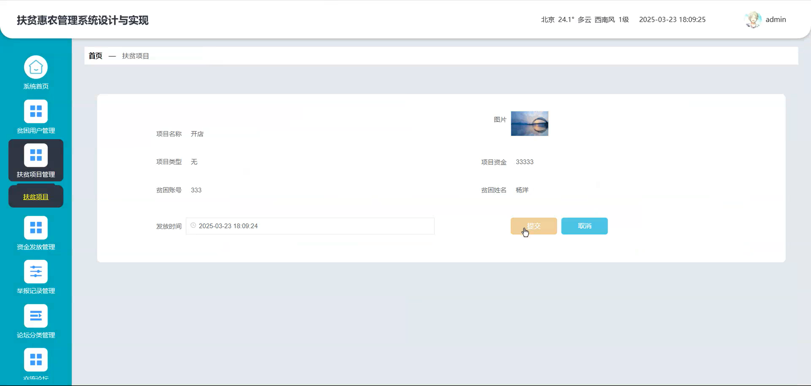

# springbootA444D
springbootA444D扶贫惠农管理系统+LW+PPT
 
## 查看主页获取源码

### 一、关键词
扶贫项目管理、资金发放管理、贫困用户管理

### 二、作品包含
源码+数据库+设计文档万字+ppt+全套环境和工具资源+本地部署教程

### 三、项目技术
前端技术：Html、Css、Js、Vue2.0、Element-ui 
后端技术：Java、SpringBoot2.0、MyBatis

### 四、运行环境（以下版本亲测，其他版本未知，请自测）
开发工具：IDEA/eclipse  + VSCODE

数据库：MySQL5.7（最低要5.7版本）

数据库管理工具：Navicat10以上版本

环境配置软件： JDK1.8 + Maven3.6.3

前端Nodejs：14

浏览器：谷歌浏览器

### 五、项目介绍
项目编号：springbootA444D

扶贫惠农管理系统主要用于整合管理贫困用户、扶贫项目等相关事务，为扶贫惠农工作提供集中化、规范化的操作与管理支持。

角色：管理员、用户

管理员：系统首页、贫困用户管理、扶贫项目管理、资金发放管理、举报记录管理、论坛分类管理、交流论坛、敏感词管理、系统管理、个人中心。

用户：系统首页、扶贫项目、交流论坛、公告资讯、个人中心、修改密码、扶贫项目、资金发放、我的发布、我的地址、我的收藏。

### 六、运行截图

